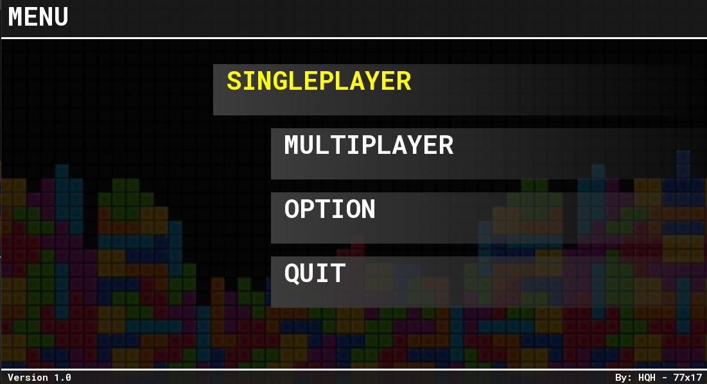
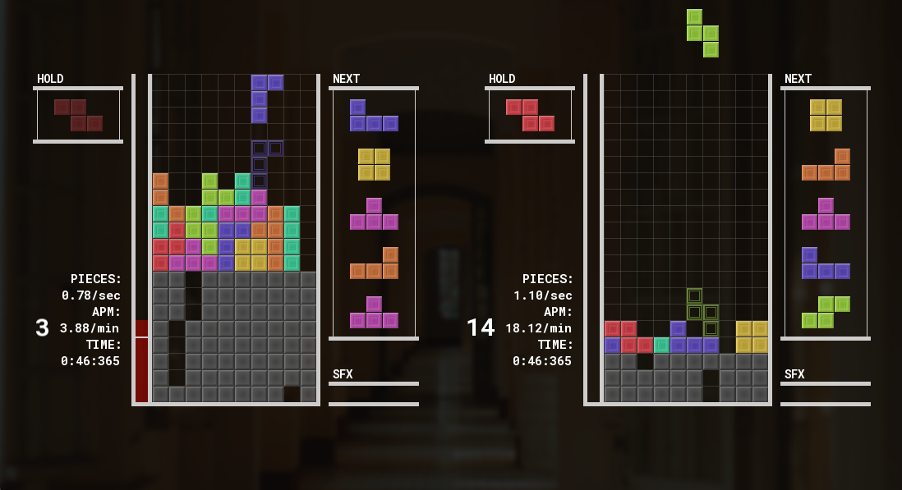

# Tetris++ - Multiplayer Tetris Game in C++ with SFML

Tetris++ is a modern Tetris game developed in C++ using the [SFML](https://www.sfml-dev.org/) multimedia library. It supports both **single-player** and **LAN-based multiplayer** gameplay, offering a smooth and competitive experience inspired by the rules and mechanics of [Tetr.io](https://tetr.io).

## 🎮 Features

### 🧍 Single Player Mode
- **Classic Mode**: Traditional Tetris gameplay with increasing difficulty.
- **Bot Mode**: Play against a simple AI bot.
- **Solo Practice**: Improve your skills with no pressure.

### 👥 Multiplayer Mode (LAN)
- Two players can compete over a local network.
- Real-time block exchange and garbage mechanics similar to Tetr.io.
- Low-latency communication using TCP sockets.

### 📏 Gameplay Rules (Inspired by Tetr.io)
- 7-bag randomizer for Tetromino generation.
- T-spin detection, back-to-back bonuses.
- Combo and garbage line mechanics.
- Soft drop, hard drop, hold queue, and next pieces preview.
- Garbage canceling and garbage blocking similar to Tetr.io.

### 🛠️ Built With
- **C++17**
- **SFML 2.5+** (Graphics, Window, Audio)
- **Custom Networking** using TCP

## 🖼️ Screenshots

<p align="center">
  <a href="./menu.png">
    
  </a>
  <br/>
  <em>Menu Screenshot</em>
</p>
<p align="center">
  <a href="./image.png">
    
  </a>
  <br/>
  <em>Main Interface</em>
</p>

## 🔧 Installation

### Prerequisites
- A C++17 compatible compiler
- SFML 2.5 or later

### Build Instructions
```bash
git https://github.com/HCMUS-HQHuy/Tetris.git
cd Tetris
make run
```

## 👥 Contributors
* [@HCMUS-HQHuy](https://github.com/HCMUS-HQHuy) - Huỳnh Quốc Huy
* [@77x17](https://github.com/77x17) - Phan Ngưng